# PiVideo Setup Guide

Step-by-step walkthrough for flashing a PiVideo SD card using Raspberry Pi Imager v2.

---

## 1. Add the PiVideo repository

Open Raspberry Pi Imager. Click **App Options** (bottom left).

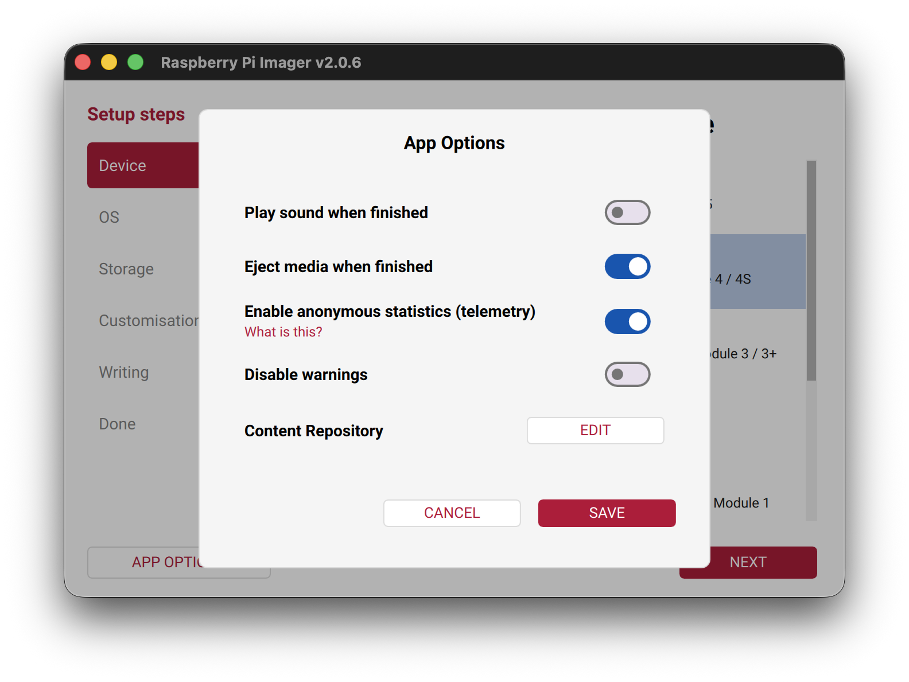

Click **Edit** next to **Content Repository**. Select **Use custom URL** and paste in:

```
https://cd34.github.io/PiVideo/os_list.json
```

Click **Apply & Restart**.

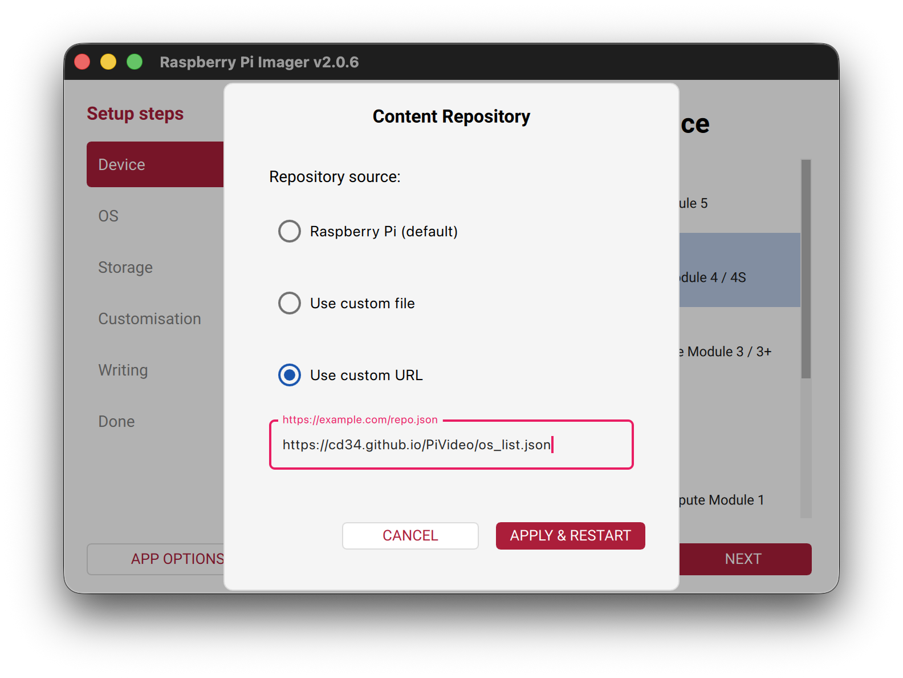

---

## 2. Select your device

Click **Next** on the Device screen and select your Raspberry Pi model.

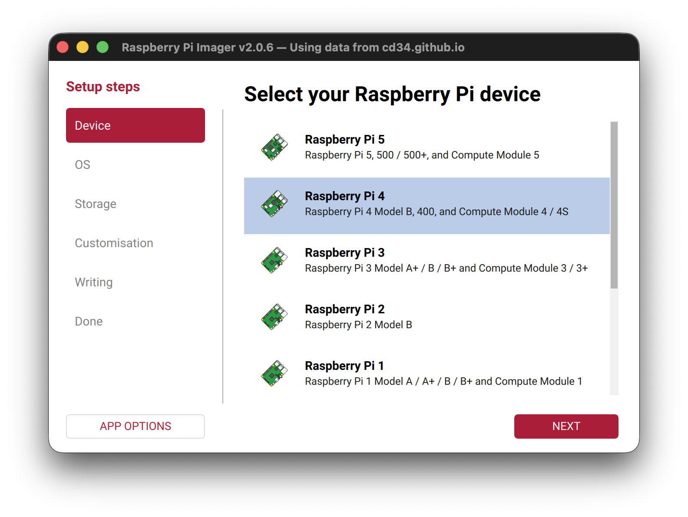

---

## 3. Select PiVideo

On the OS screen, select **PiVideo**.

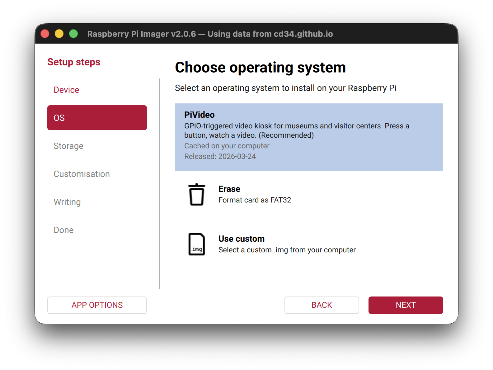

---

## 4. Select your SD card

On the Storage screen, select your SD card.

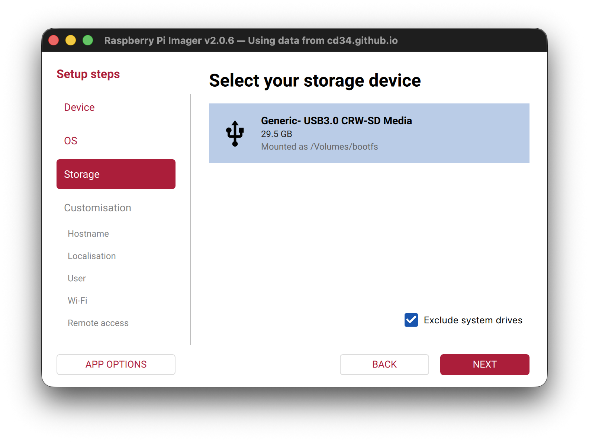

---

## 5. Hostname

Enter a name for this Pi. It will be reachable at `http://<hostname>.local:8080`.

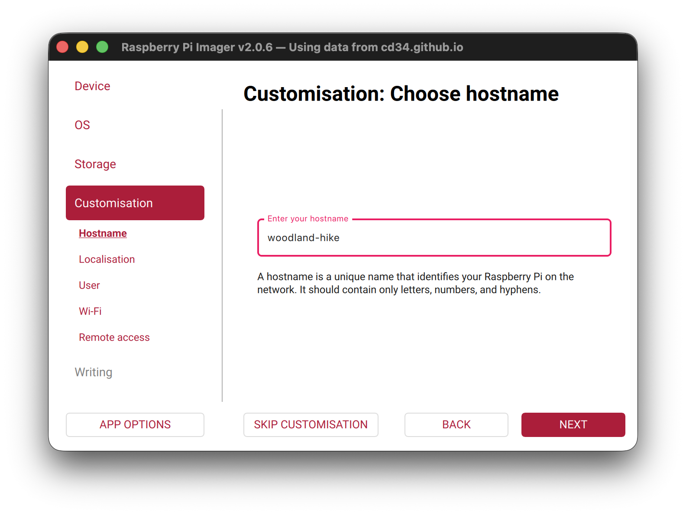

- Pick something descriptive for the location, e.g. `woodland-hike` or `glacier-trailhead`
- Must be unique on your network — two Pis with the same hostname will conflict
- Letters, numbers, and hyphens only; cannot start or end with a hyphen; maximum 63 characters

---

## 6. Localisation

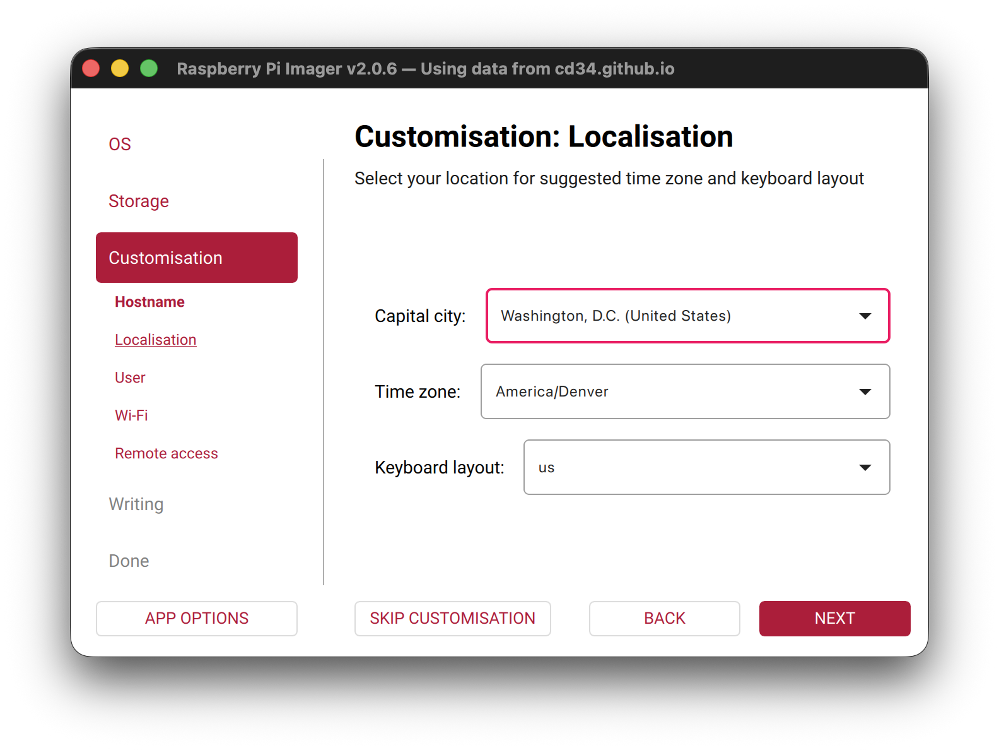

- **Capital city** — select **Washington, D.C. (United States)** for US installations
- **Time zone** — select your region, e.g. `America/Denver` or `America/New_York`
- **Keyboard layout** — `us` for US keyboards

---

## 7. Username and password

Create a user account for SSH access. You will probably never need this, but set something you can remember.

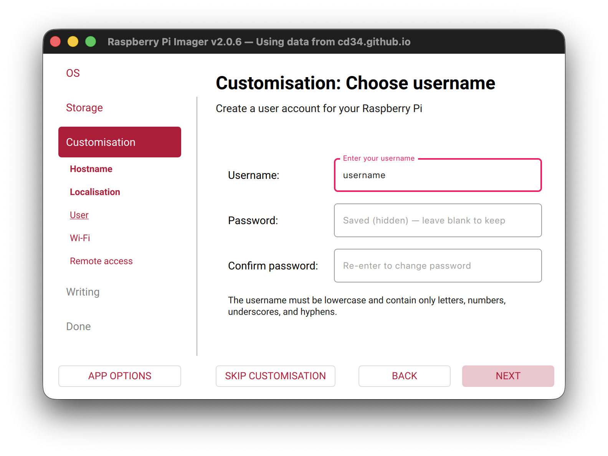

---

## 8. Wi-Fi

Enter your WiFi network name (SSID) and password.

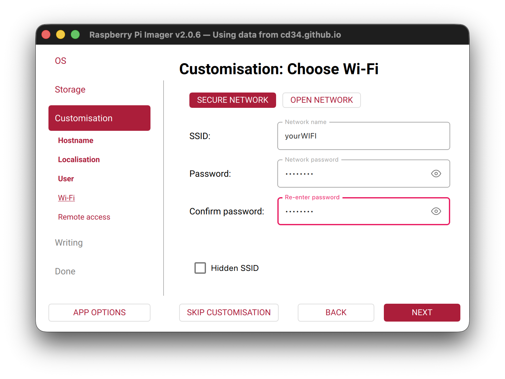

---

## 9. SSH

Enable **SSH** and select **Use password authentication**.

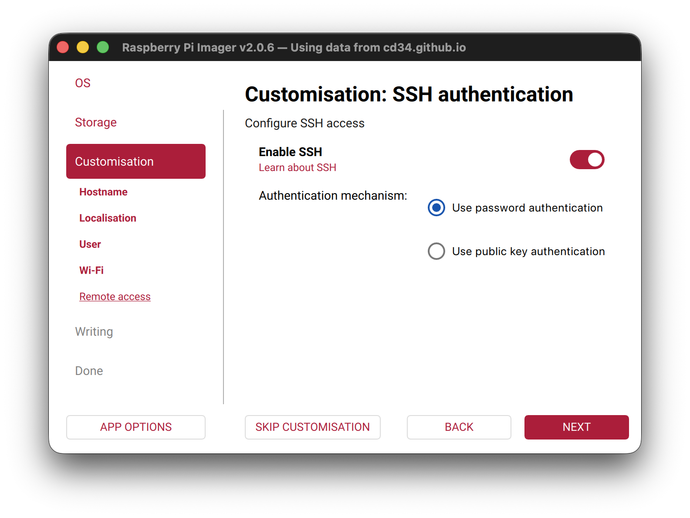

---

## 10. Write the image

Review the summary and click **Write**.

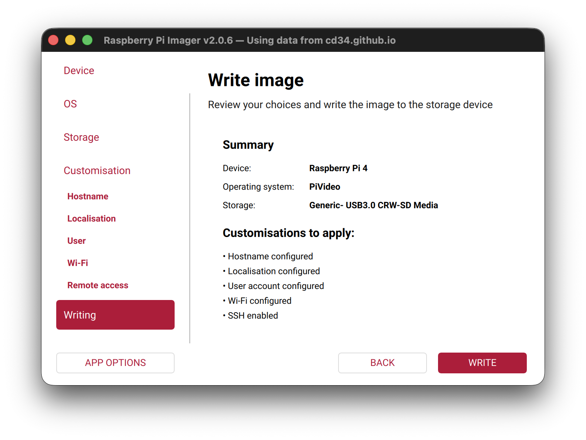

Raspberry Pi Imager will write the image and eject the card automatically when finished.

Insert the SD card into the Raspberry Pi and power it on. Wait about 2 minutes for first boot to complete, then open a browser and go to:

```
http://<hostname>.local:8080
```
